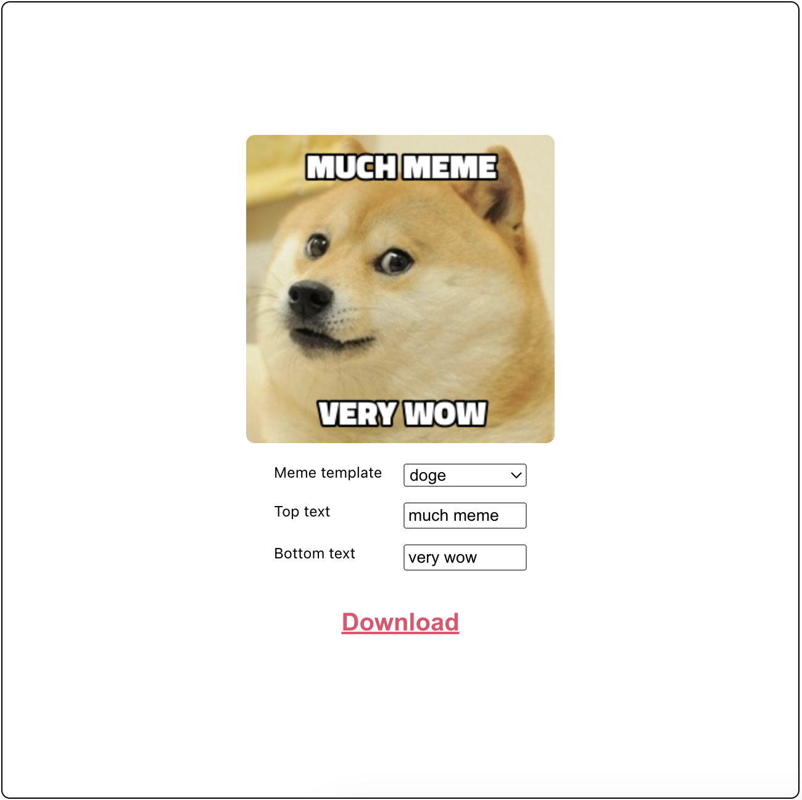

# Simple meme generator widget using a public API.

This react meme generator was created as part of the UpLeveled GmbH coding boot camp and is using the "https://api.memegen.link/" public API. You can open the deployed app here: https://elaborate-licorice-adc6d5.netlify.app/

## Core features

- The dropdown "meme template" allows you to select any available meme template from a list.
- On page load, the first meme in this list is shown by default.
- When selecting another template from the dropdown, the new image is rendered immediately.
- By default, the top and bottom texts are empty on page load.
- You can leave the text empty, only enter the top text, only enter the bottom text, or enter both.
- The image that is shown on the screen (incl. the text) can be downloaded using the "Download" button.
- The .jpg file will be downloaded to your default "Downloads" folder.

## Implementation details

- Design was created in Figma and then manually created with css (not exported).
- Separate components were created for the elements in this app.
- Components are reused for similar functionality (for the text input).
- All states are lifted up to the App.js component.
- A JSON file from "memegen.link" has been used to generate a list of all available meme templates.
